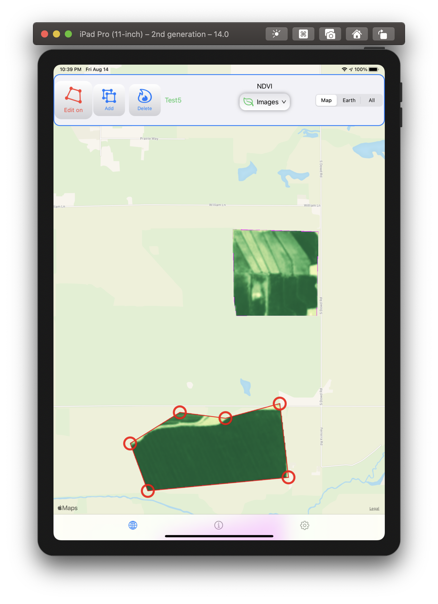

# SwiftUI satellite imagery app using the Agro API library

  
   
   

## AgroDonkey

A satellite imagery app to showcase my [**AgroAPI**](https://github.com/workingDog/AgroAPI) swift library.
This **AgroDonkey** app exercises the **Polygons API**, **Satellite Imagery API** and the **Agro weather API**.  

Made for iPad iOS 14 and macOS 11 (untested), and requires a valid **OpenWeather/Agro API key**, see *Requirements*.

## Agro API

[**OpenWeather Agro API**](https://agromonitoring.com/) brings satellite images to farmers. 
"Through our simple and fast API, you can easily get multi-spectrum images of the crop for the most recent day or for a day in the past; we have the most useful images for agriculture such as NDVI, EVI, True Color and False Color."

**AgroApi** is a small Swift library to connect to the [**OpenWeather Agro API**](https://agromonitoring.com/api) and retrieve the chosen satellite imagery data. Made easy to use with SwiftUI. Includes, the Polygons, Weather, Satellite Imagery and Historical NDVI APIs.

## Usage

The concept in using satellite imagery is to first create one or more polygons representing for example, agricultural crop fields or forestry areas.
The fields are created by adding and editing points on the map to form polygons. 

Once the fields are setup, satellite images such as; true color, false color, NDVI, EVI etc... can be retrieved from the **Argo API server** for those polygons and displayed on the map. Those images are used to estimate the amount and health of the vegetation and crop development over time in those polygons.

Similarly, weather forecasts for the fields can be retrieved and presented.

**AgroDonkey** has only 3 pages:

-  the map view for imagery display and polygons creation/editing,

-  the field polygons and weather data info page, and

-  the settings page, where you enter the **required** server key.

To obtain a key you can create a free account, see [Agro API](https://agromonitoring.com/api/get) or [OpenWeather how to start](https://openweathermap.org/appid). Put this key in the **settings** page and press **Save**. It will be used again the next time you open the app. Note the size and location of the polygons restrictions for the free plan, [Polygons API](https://agromonitoring.com/api/polygons).

To add a new field, click the **Add** button and click the map to add points. Click the **Add** button again to deactivate it.
**Tip**, it is sometimes easier to just roughly put a number of points on the map, then use the **Edit** function to refine the markers positions.
Note, the edge bewteen the last and first points will be added automatically, **no need to add the last point to close the polygon**.

To edit a polygon, click the **Edit** button and then click on the desire polygon on the map. To exit editing, click on the polygon or the **Edit** button again.

On the **Info page**, you can rename and delete the desired fields (swipe left). You can also display the weather for a field, by clicking on the desired field in the list.

### References

-    [**OpenWeather Agro API**](https://agromonitoring.com/api)

### Requirements

Requires a valid OpenWeather/Agro API key, see:

-    [OpenWeather how to start](https://openweathermap.org/appid)

-    [Agro API](https://agromonitoring.com/api/get)

### License

MIT
